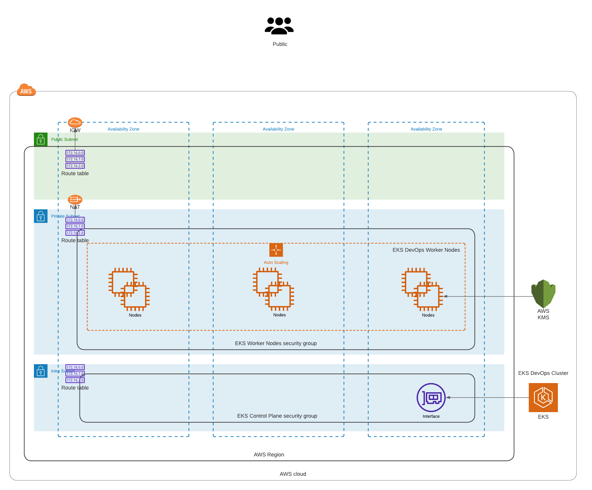

## Summary

This repo will create a create your custom EKS environment.

## Basic Architecture



## Pre-requisite

- A valid AWS profile ready to use via CLI
- Terraform version > 1.1.5 (version 1.3.7 suggested)
- awscli installed and ready to use via CLI
- kubectl installed and ready to use via CLI

## Built with:

* Terraform (v1.3.7)
* AWS_ACCESS_KEYS and AWS_SECRET_ACCESS_KEYS are set as environment variables (link: https://docs.aws.amazon.com/cli/latest/userguide/cli-configure-envvars.html).

### Step by Step deployment
* **Step 1: Clone the Repo**. This command will clone the repo and will change directory the recently cloned repo
```shell script
$ git clone https://github.com/antonio-rufo/tf-gnyalakonda-eks.git
```

* **Step 2: Create your infrastructure.** Update the `terraform.tfvars` file with your `account ID`, `region` (Optional), and `environment` (Optional). Then update variables as you desire or leave them as default. Then update `main.tf` with the **state_bucket_id** created in step 2 (line 18) as well as the **region** (line 20).
```shell script
$ cd infrastructure
$ vi terraform.tfvars
$ vi main.tf
```
Create the resources:
```shell script
$ terraform init
$ terraform plan
$ terraform apply --auto-approve
```

* **Step 3: Test that you can connect to your EKS cluster.** Since part of the Terraform code is to update the kubeconfig. You should be able to connect to the EKS cluster as soon as Step 4 completes.
```shell script
kubectl get nodes
kubectl get pods -n kube-system
```
